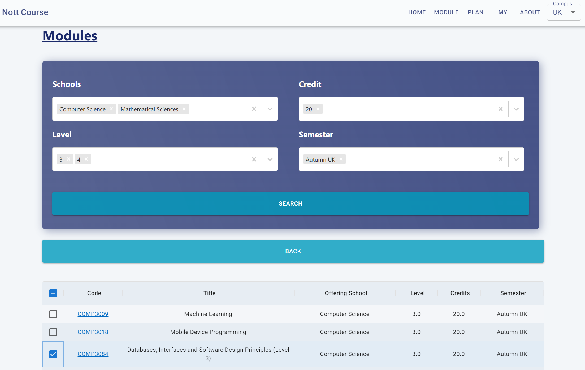

<div id="top"></div>

[![Contributors][contributors-shield]][contributors-url]
[![Forks][forks-shield]][forks-url]
[![Stargazers][stars-shield]][stars-url]
[![Issues][issues-shield]][issues-url]
[![MIT License][license-shield]][license-url]


<!-- PROJECT LOGO -->
<br />
<div align="center">
    
    <h3 align="center">Nott Course</h3>

  <p align="center">
    An unofficial enhancement of the University of Nottingham course catalogue 
    <!-- <br /> -->
    <!-- <a href="https://github.com/EricWay1024/nott-course"><strong>Explore the docs »</strong></a> -->
    <br />
    <br />
    <a href="https://nott-course.uk/">View Current Build</a>
    ·
    <a href="https://github.com/EricWay1024/nott-course/issues">Open Issues</a>
  </p>
</div>


<!-- ABOUT THE PROJECT -->
## About The Project



Better UX for the UoN course catalogue. 
<a href="https://campus.nottingham.ac.uk/psp/csprd_pub/EMPLOYEE/HRMS/c/UN_PROG_AND_MOD_EXTRACT.UN_PAM_CRSE_EXTRCT.GBL">The official catalogue</a> contains abundant useful information regarding modules and academic plans, but is extremely frustrating to use.
Built for potential or current students to better utilise publicly available data for their plan or module choices, Nott Course is featured with

- FULL data of current year's catalogue;
- Responsive UI design;
- Free navigation from plans to modules;
- Advanced filters for modules and plans;
- Easy drafting of module selections;
- Generating a list of assessments based on selected modules.

See the [open issues](https://github.com/EricWay1024/nott-course/issues) for a full list of proposed features and known issues.

**The current developers have graduated from UoN. If you would like to take over this project, please contact me via the email at the bottom of this page.**

### Built With

* [React.js](https://reactjs.org/);
* [Material UI](https://mui.com);
* Hosted on [Cloudflare Pages](https://pages.dev/).

### Sister Repos

This repo only contains the frontend of this web project. It is built in conjunction with the following:

- [The C++ backend server](https://github.com/EricWay1024/nott-course-server-cpp) and 
- [The new (as of October 2024) Python crawler](https://github.com/EricWay1024/nottCrawlerNew).

<!-- GETTING STARTED -->
## Getting Started

To get a local copy up and running follow these simple example steps.

### Prerequisites

* npm
  ```sh
  npm install npm@latest -g
  ```

### Installation


1. Clone the repo
   ```sh
   git clone https://github.com/EricWay1024/nott-course.git
   ```
2. Install NPM packages
   ```sh
   npm install
   ```
  

<!-- USAGE EXAMPLES -->
## Usage

Start a local server:
```sh
npm start
```

Production build:
```sh
npm run build
```


<!-- ROADMAP -->
<!-- ## Roadmap

- [ ] Feature 1
- [ ] Feature 2
- [ ] Feature 3
    - [ ] Nested Feature

 -->


<!-- CONTRIBUTING -->
## Contributing

Contributions are what make the open source community such an amazing place to learn, inspire, and create. Any contributions you make are **greatly appreciated**.

If you have a suggestion that would make this better, please fork the repo and create a pull request. You can also simply open an issue with the tag "enhancement".
Don't forget to give the project a star! Thanks again!

1. Fork the Project
2. Create your Feature Branch (`git checkout -b feature/AmazingFeature`)
3. Commit your Changes (`git commit -m 'Add some AmazingFeature'`)
4. Push to the Branch (`git push origin feature/AmazingFeature`)
5. Open a Pull Request


<!-- LICENSE -->
## License

Distributed under the MIT License. See `LICENSE.txt` for more information.


<!-- CONTACT -->
## Contact

Yuhang "Eric" Wei - ericway1024@gmail.com

<!-- ACKNOWLEDGMENTS -->
## Acknowledgments

* [uFair-Tech/uCourse-crawler](https://github.com/uFair-Tech/uCourse-crawler)
* [Course Extract](https://campus.nottingham.ac.uk/psp/csprd_pub/EMPLOYEE/HRMS/c/UN_PROG_AND_MOD_EXTRACT.UN_PAM_CRSE_EXTRCT.GBL)
* [othneildrew/Best-README-Template](https://github.com/othneildrew/Best-README-Template)
* [Favicon Generator - Text to Favicon - favicon.io](https://favicon.io/favicon-generator/)


<!-- MARKDOWN LINKS & IMAGES -->
<!-- https://www.markdownguide.org/basic-syntax/#reference-style-links -->
[contributors-shield]: https://img.shields.io/github/contributors/EricWay1024/nott-course.svg?style=for-the-badge
[contributors-url]: https://github.com/EricWay1024/nott-course/graphs/contributors
[forks-shield]: https://img.shields.io/github/forks/EricWay1024/nott-course.svg?style=for-the-badge
[forks-url]: https://github.com/EricWay1024/nott-course/network/members
[stars-shield]: https://img.shields.io/github/stars/EricWay1024/nott-course.svg?style=for-the-badge
[stars-url]: https://github.com/EricWay1024/nott-course/stargazers
[issues-shield]: https://img.shields.io/github/issues/EricWay1024/nott-course.svg?style=for-the-badge
[issues-url]: https://github.com/EricWay1024/nott-course/issues
[license-shield]: https://img.shields.io/github/license/EricWay1024/nott-course.svg?style=for-the-badge
[license-url]: https://github.com/EricWay1024/nott-course/blob/master/LICENSE.txt
